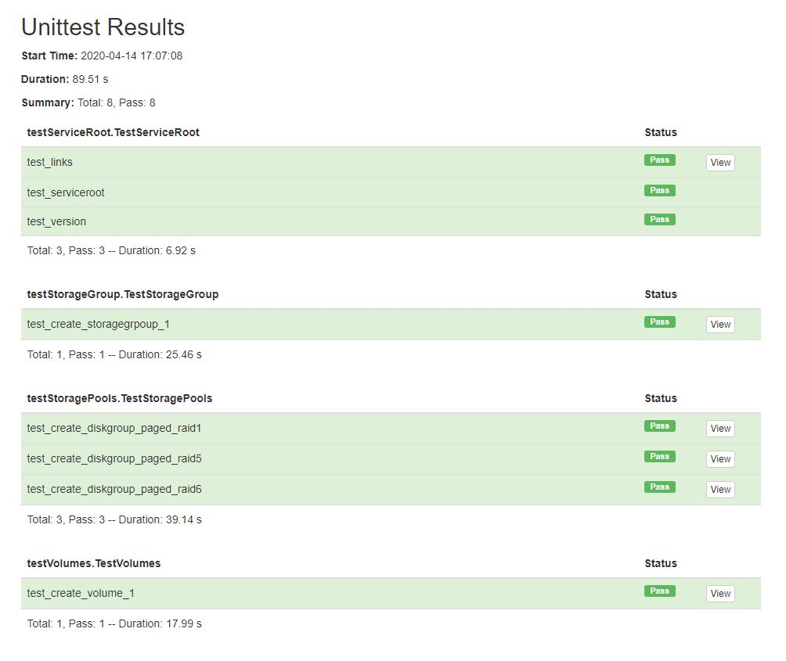
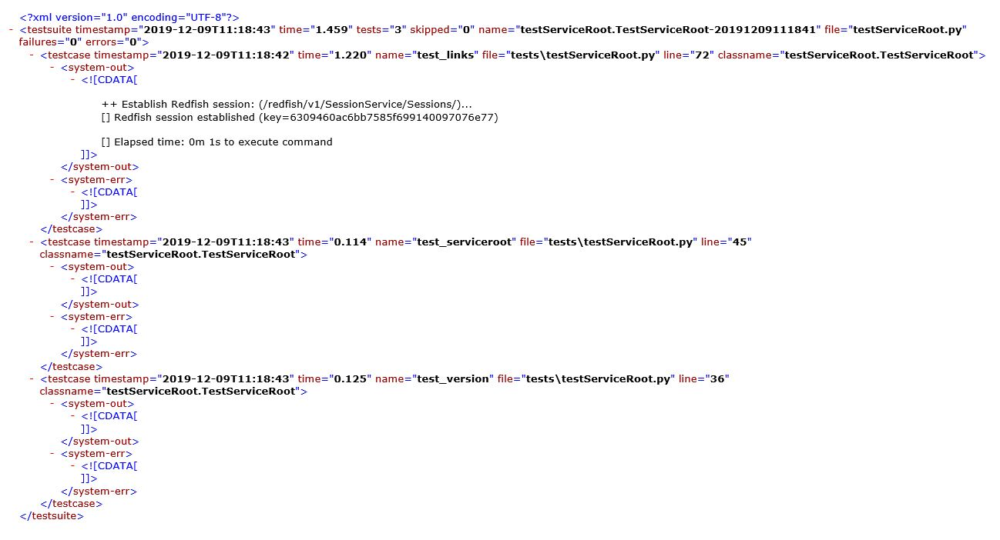

# Redfish Service Unit Test


## Introduction

This reference includes unit test cases for validating the Redfish Service provided. The main goal of the test cases
is to verify that key features of the service are working related to storage provisioning and manageability.

## Perquisites

The unit test cases rely on the python unittest class which requires no additional installs, but the reports generated
do rely on two additional packages. Namely, HtmlTestRunner and XmlRunner. Each is a separate install, but you will need to
only install one, or both, depending on your desire to generate HTML and/or XML reports.

| Package              | Link                                                                                                       |
| -------------------- | ------------------------------------------                                                                 |
| HtmlTestRunner       | [https://github.com/oldani/HtmlTestRunner](https://github.com/oldani/HtmlTestRunner)                       |
| xmlrunner            | [https://github.com/xmlrunner/unittest-xml-reporting](https://github.com/xmlrunner/unittest-xml-reporting) |

These packages can be installed using:

| Package              | Installation|
| -------------------- | ----------------------------|
| HtmlTestRunner       | pip install html-testRunner |
| xmlrunner            | pip install xmlrunner       |


## Generating HTML Reports

Run the following command to execute all unit test cases, generate an HTML report, and launch a web browser with the
generated report. If no option is supplied, an HTML report is generated by default.  The newly created report is stored
in the **reports** folder with an '.html' extension.

**Note:** The HTML test cases are generated to a single HTML file.

```
python redfishUnittest.py --html -c myconfig.json
```

### Sample Console Output

When running the unit test cases, console output is generated that will look similar to the following.

```
python redfishUnittest.py --html -c myconfig.json

--------------------------------------------------------------------------------
[] Redfish Unit Tests
--------------------------------------------------------------------------------
++ Generate HTML Report

Running tests...
----------------------------------------------------------------------
 test_links (testServiceRoot.TestServiceRoot) ... OK (1.186824)s
 test_serviceroot (testServiceRoot.TestServiceRoot) ... OK (0.085062)s
 test_version (testServiceRoot.TestServiceRoot) ... OK (0.123454)s
 test_create_diskgroup_paged_raid1 (testStoragePools.TestStoragePools) ... OK (13.100104)s
 test_create_diskgroup_paged_raid5 (testStoragePools.TestStoragePools) ... OK (14.024150)s
 test_create_diskgroup_paged_raid6 (testStoragePools.TestStoragePools) ... OK (16.008017)s
 test_create_volume_1 (testVolumes.TestVolumes) ... OK (15.968740)s

----------------------------------------------------------------------
Ran 7 tests in 0:01:00

OK

Generating HTML reports...
reports\TestResults_TestServiceRoot_TestStoragePools_TestVolumes_2019-12-09_10-57-57.html
```

### Sample HTML Report




## Generating XML Reports

Run the following command to execute all unit test cases and generate XML reports. The newly created reports are
stored in the **reports** folder with '.xml' extensions.

**Note:** The XML test cases are generated to multiple XML files.

```
python redfishUnittest.py --xml -c myconfig.json
```
 
 
### Sample Console Output

When running the unit test cases, console output is generated that will look similar to the following.

```
python redfishUnittest.py --xml -c myconfig.json

--------------------------------------------------------------------------------
[] Redfish Unit Tests
--------------------------------------------------------------------------------
++ Generate XML Report

Running tests...
----------------------------------------------------------------------

++ Establish Redfish session: (/redfish/v1/SessionService/Sessions/)...
[] Redfish session established (key=6309460ac6bb7585f699140097076e77)

...
++ Establish Redfish session: (/redfish/v1/SessionService/Sessions/)...
[] Redfish session established (key=2c8a6de2d039828999a22660907c4f9b)

++ initialize_disks: membersCount=24, totalDrives=24

++ Create Disk Group: (create diskgroup name=dgA01 disks=0.0,0.1 pool=A level=raid1)...
   -- Status        : 201
   -- Reason        : Created
   -- SerialNumber  : A
   -- Id            : 00c0ff5112460000a62dee5d01000000


[] DELETE (/redfish/v1/StorageServices/S1/StoragePools/A)
   -- status=200, reason=OK
(1) DELETE commands were successful


.
++ Establish Redfish session: (/redfish/v1/SessionService/Sessions/)...
[] Redfish session established (key=718bfdf61f3ebbd26f5d57f01afbf1d9)

++ initialize_disks: membersCount=24, totalDrives=24

++ Create Disk Group: (create diskgroup name=dgA02 disks=0.0,0.1,0.10,0.11 pool=A level=raid5)...
   -- Status        : 201
   -- Reason        : Created
   -- SerialNumber  : A
   -- Id            : 00c0ff5112460000b42dee5d01000000


[] DELETE (/redfish/v1/StorageServices/S1/StoragePools/A)
   -- status=200, reason=OK
(1) DELETE commands were successful


.
++ Establish Redfish session: (/redfish/v1/SessionService/Sessions/)...
[] Redfish session established (key=560745789de5a3ee9e61ba88e0469103)

++ initialize_disks: membersCount=24, totalDrives=24

++ Create Disk Group: (create diskgroup name=dgA03 disks=0.0,0.1,0.10,0.11,0.12,0.13 pool=A level=raid6)...
   -- Status        : 201
   -- Reason        : Created
   -- SerialNumber  : A
   -- Id            : 00c0ff5112460000c22dee5d01000000


[] DELETE (/redfish/v1/StorageServices/S1/StoragePools/A)
   -- status=200, reason=OK
(1) DELETE commands were successful


.
++ Establish Redfish session: (/redfish/v1/SessionService/Sessions/)...
[] Redfish session established (key=7b37e39788fbeb43b3f2b54f6307ba3f)

++ initialize_disks: membersCount=24, totalDrives=24

++ Create Disk Group: (create diskgroup name=dgA02 disks=0.0,0.1,0.10,0.11 pool=A level=raid5)...
   -- Status        : 201
   -- Reason        : Created
   -- SerialNumber  : A
   -- Id            : 00c0ff5112460000d12dee5d01000000


++ Create Volume: (create volume name=TestVolume01 size=10000000 pool=A)...
   -- Status        : 201
   -- Reason        : Created
   -- Name          : TestVolume01
   -- SerialNumber  : 00c0ff5112460000d22dee5d01000000


[] DELETE (/redfish/v1/StorageServices/S1/Volumes/TestVolume01)
   -- status=200, reason=OK
(1) DELETE commands were successful


[] DELETE (/redfish/v1/StorageServices/S1/StoragePools/A)
   -- status=200, reason=OK
(1) DELETE commands were successful


.
----------------------------------------------------------------------
Ran 7 tests in 61.290s

OK

Generating XML reports...
```

### Sample XML Report




## Unit Test Design

The main redfishUnitetest.py module performs a few simple steps:

1. Parse command line arguments, to decide on HTML or XML reporting. HTML is the default option.
2. Use TestLoader to discover all possible test cases from the **tests** folder. New test cases are automatically included.
3. Run the tests, generate a report, and display the report(s) in the default web browser.

The unit test cases are grouped according to supported Redfish models. In addition, there are a couple additional support classes.

For example, the Redfish ServiceRoot unit test cases are contained in tests/testServiceRoot.py, and Volume unit test cases are
found in tests/testVolumes.py, etc. 

The main design goal is that each unit test case, and each test suite (testVolumes.py) run independently without running any other
test cases. This results in system build up and tear down for each test case, but provides consistency with the unit test case
design goal.

Here is a list of other modules provided to ease test case development:
- **RedfishCommand** provides an easy way to execute a Redfish service command.
- **RedfishConfig** stores host-based system configuration data used by all the test cases, such as user credentials.
- **jsonExtract** provides an easy way to extract values, or lists of values, from JSON data
- **testSystem** provides routines to query the storage system and routines to extract data, such as next available disk drive.
- **testSupport** provides routines to create disk groups, volumes, and other routines used by many other test cases.

